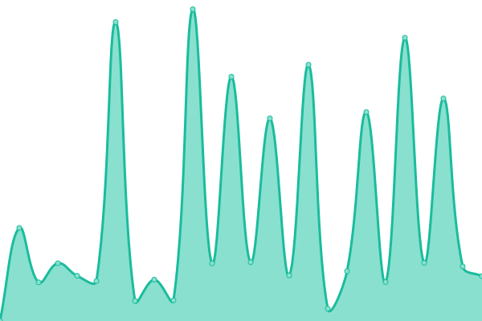
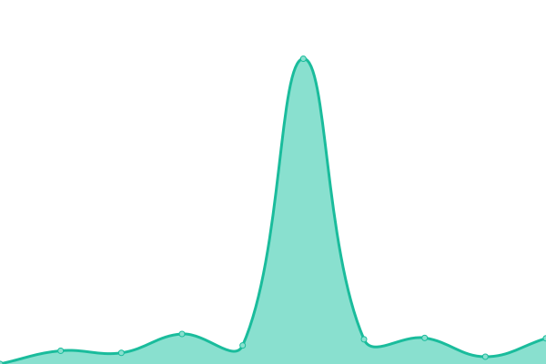

# [📈 Live Status](https://CoopPlayzz.github.io/Webstatus-sports): <!--live status--> **🟩 All systems operational**

This repository contains the open-source uptime monitor and status page for [Coop](coopos.github.io/CoopOS), powered by [Upptime](https://github.com/upptime/upptime).

With [Upptime](https://upptime.js.org), you can get your own unlimited and free uptime monitor and status page, powered entirely by a GitHub repository. We use [Issues](https://github.com/CoopPlayzz/Webstatus-sports/issues) as incident reports, [Actions](https://github.com/CoopPlayzz/Webstatus-sports/actions) as uptime monitors, and [Pages](https://CoopPlayzz.github.io/Webstatus-sports) for the status page.

<!--start: status pages-->
<!-- This summary is generated by Upptime (https://github.com/upptime/upptime) -->
<!-- Do not edit this manually, your changes will be overwritten -->
<!-- prettier-ignore -->
| URL | Status | History | Response Time | Uptime |
| --- | ------ | ------- | ------------- | ------ |
|  [BTN [Big Ten Network]](https://btn.com) | 🟩 Up | [btn-big-ten-network.yml](https://github.com/CoopPlayzz/Webstatus-sports/commits/HEAD/history/btn-big-ten-network.yml) | 

 93ms
     
 | 

<a href="https://CoopPlayzz.github.io/Webstatus-sports/history/btn-big-ten-network">100.00%</a>
    

|  [ESPN](https://espn.com) | 🟩 Up | [espn.yml](https://github.com/CoopPlayzz/Webstatus-sports/commits/HEAD/history/espn.yml) | 

 650ms
     
 | 

<a href="https://CoopPlayzz.github.io/Webstatus-sports/history/espn">98.65%</a>
    

|  [Fox Sports](https://foxsports.com) | 🟩 Up | [fox-sports.yml](https://github.com/CoopPlayzz/Webstatus-sports/commits/HEAD/history/fox-sports.yml) | 

 235ms
     
 | 

<a href="https://CoopPlayzz.github.io/Webstatus-sports/history/fox-sports">100.00%</a>
    

|  [CBS Sports](https://www.cbssports.com) | 🟩 Up | [cbs-sports.yml](https://github.com/CoopPlayzz/Webstatus-sports/commits/HEAD/history/cbs-sports.yml) | 

 129ms
     
 | 

<a href="https://CoopPlayzz.github.io/Webstatus-sports/history/cbs-sports">100.00%</a>
    

|  [NCAA](https://www.ncaa.com) | 🟩 Up | [ncaa.yml](https://github.com/CoopPlayzz/Webstatus-sports/commits/HEAD/history/ncaa.yml) | 

 387ms
     
 | 

<a href="https://CoopPlayzz.github.io/Webstatus-sports/history/ncaa">99.73%</a>
    

<!--end: status pages-->

[**Visit our status website →**](https://CoopPlayzz.github.io/Webstatus-sports)

## 📄 License

- Powered by: [Upptime](https://github.com/upptime/upptime)
- Code: [MIT](./LICENSE) © [Coop](coopos.github.io/CoopOS)
- Data in the `./history` directory: [Open Database License](https://opendatacommons.org/licenses/odbl/1-0/)
